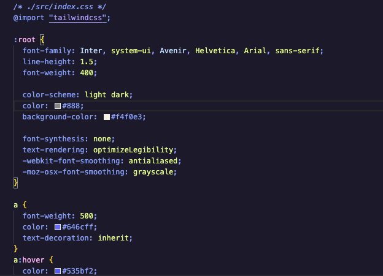
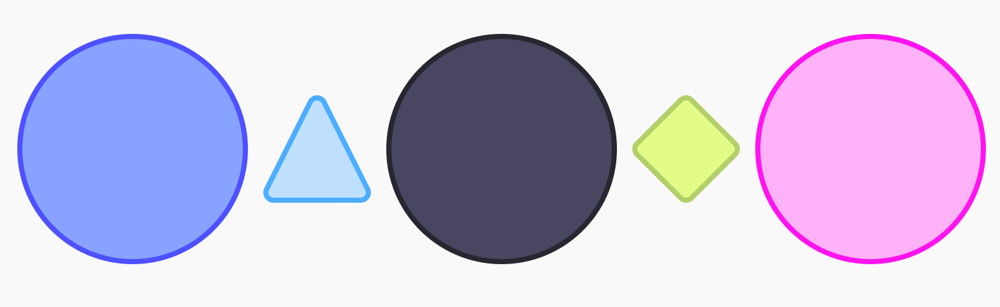

# Space Jam: A Dark Theme for VS Code
A space themed VS code theme. 

### Preview Here!

  

    
  

   
  

## For more information
* [Space Jam Github Repository](https://github.com/canavarrete01/space-jam-dark.git)
* [Personal Website with More Projects](https://canavarrete01.github.io/)

**Enjoy and have fun coding!**

##
Update: Updated Color Palette and new Light Mode (!)